# ByteBabies – Crèche Management Mobile App
## Team Members:
- ST10266113 - Hassan Abdul Razzaq 

- ST10293797 – Usaid Valodia 

- ST10266347 RIDHWAAN RAWAT 

- ST10357430 - MUHAMMAD SHAIKH

- ST10300672 – Brayden Pillay

---

**ByteBabies** is a mobile application designed to **streamline daily operations in crèches and early childhood care centers**.  
It provides **Admins**, **Teachers**, and **Parents** a unified digital platform built using **Android Jetpack Compose**, **Kotlin**, and **Firebase**, supporting real-time updates, secure authentication, and role-based access.

The app replaces traditional pen-and-paper management with **digital record-keeping, attendance tracking, messaging, and payment processing**, enhancing efficiency, transparency, and parent engagement.

---

## Updated Key Features

### Admin Module
Admins have full control over the crèche operations with the following functionalities:

- **Parent & Child Management** – Add, edit, and assign parents, children, and teachers. Enforces relational integrity; e.g., a parent with children cannot be deleted.
- **Attendance Tracking** – Mark daily attendance, with automated notifications to parents for absent children. Supports viewing historical attendance.
- **Event Management** – Create, update, and manage school events with dates, locations, and descriptions. Events are displayed to both Admins and Parents.
- **Meal Planning** – Define and publish daily/weekly menus with dietary information. Parents can pre-order meals via the app.
- **Media Uploads** – Upload images and videos from classrooms, respecting parental consent for sharing media.
- **Messaging System** – Send announcements and receive messages from parents. Messages include timestamps and can be filtered by sender/recipient.
- **Payment Gateway (PayFast Sandbox)** – Simulate tuition and meal payments securely through a sandboxed WebView integration.

**Admin Screenshots and Descriptions:**

- **Admin Dashboard**
  
  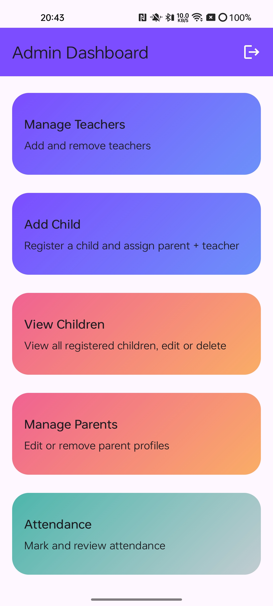  
  
  Overview of all available admin features in a visually organized card layout. Provides quick access to Teachers, Children, Parents, Attendance, Events, and Messaging.

- **Manage Parents**
  
  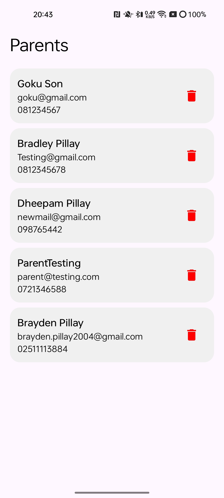  

  List of registered parents with options to edit or delete profiles. Supports validation to prevent deletion if children are assigned.

- **Manage Teachers**
  
  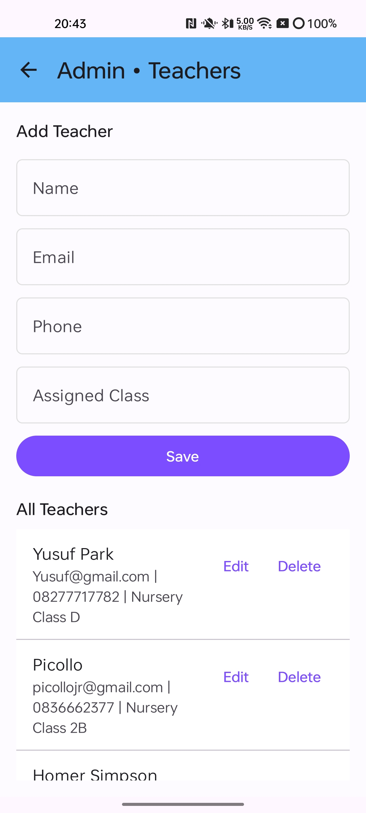  
  
  Admins can add new teachers, update information, or remove teachers. Each teacher is assigned a class for child allocation.

- **Add/View Children**
  
  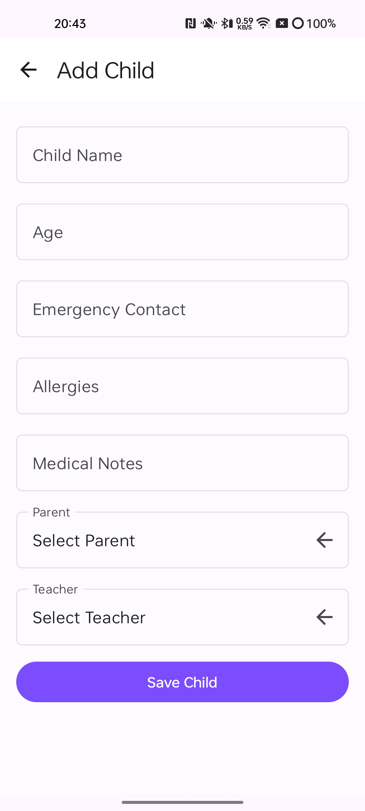  

  Register children and link them with their parent and teacher. Allows updating medical notes, allergies, and emergency contacts.

- **Attendance**
  
  Daily attendance tracker for children. Provides automatic notifications to parents for absent children and allows marking presence/absence with a single tap.

- **Events**
  
  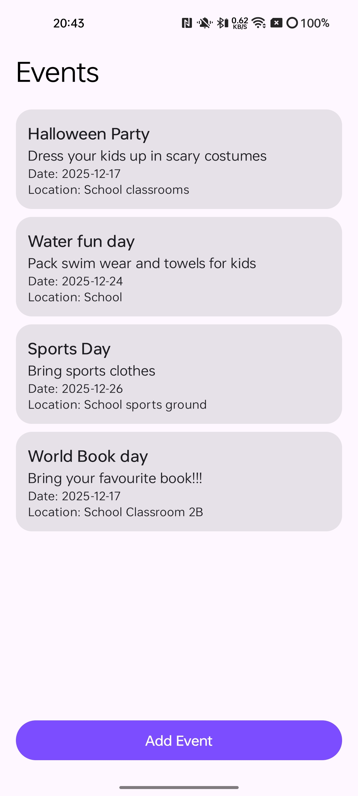
  
  Admins can create, edit, or delete events. Event notifications are automatically visible to parents.

- **Announcements & Messages**
  
  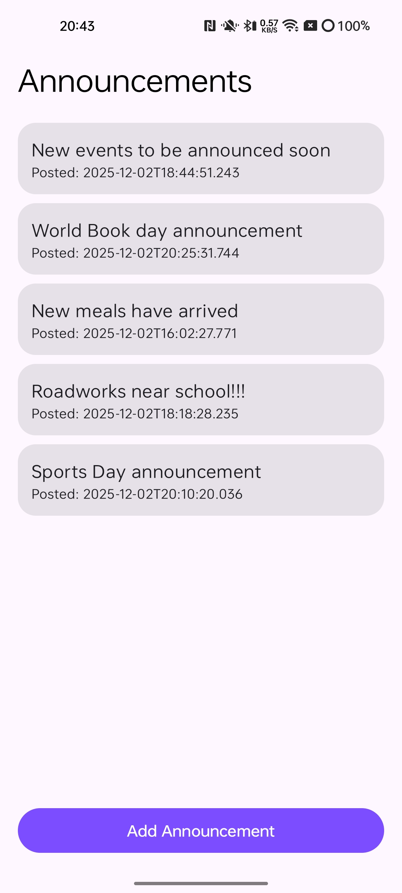 

  View messages from parents and send announcements to selected groups or all parents. Messages include timestamps and role-based visibility.

---

### Parent Module
Parents can stay informed and manage interactions with the crèche:

- **Child Profile Access** – View all registered children, their assigned teacher, age, emergency contacts, and medical details.
- **Attendance History** – Check attendance records by date and receive alerts for absences.
- **Meal Menu & Pre-Orders** – Browse daily menus and pre-order meals for children. Parents see dietary notes and consent-based media content.
- **Event Calendar** – View upcoming events, including descriptions and locations. Add events to the device calendar.
- **Media Gallery** – View classroom photos and videos (requires consent). Images are fetched in real-time via Firebase.
- **Messages** – Send messages to Admins and receive alerts or announcements. Messages are time-stamped and organized by conversation threads.
- **Payment Integration** – Secure sandboxed PayFast payments for tuition, meals, or other charges.

**Parent Screenshots and Descriptions:**

- **Parent Dashboard**
  
  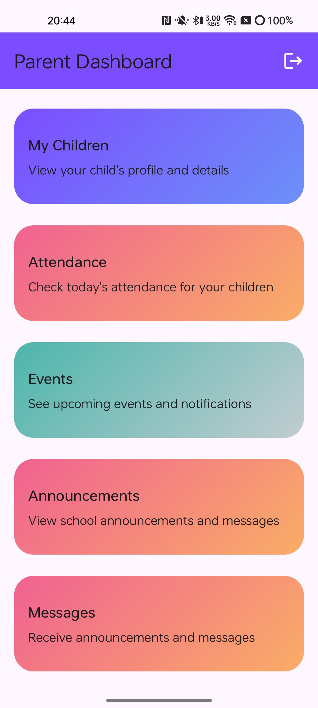  

  Quick access to child profiles, attendance, events, messages, and meal pre-orders. Features dynamic gradient cards for easy navigation.

- **Child Profile**
  
  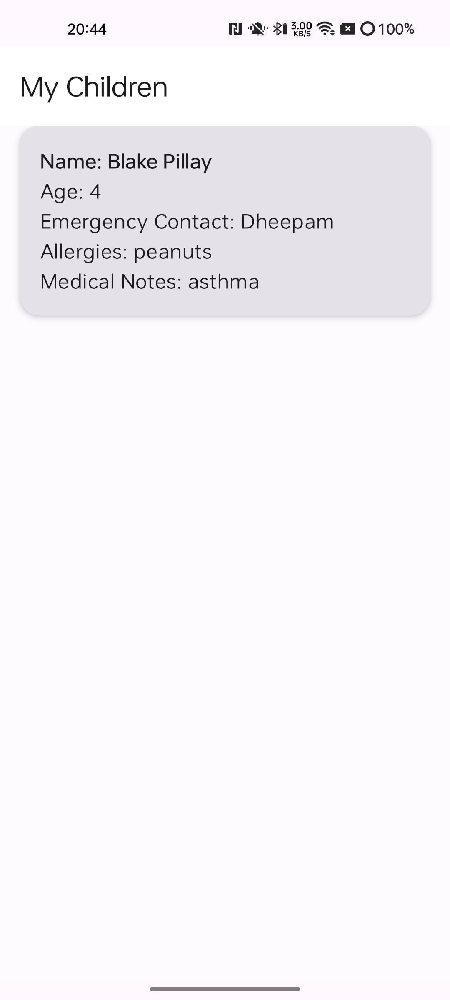  

  Displays detailed information for each child including teacher assignment, medical notes, and allergies.

- **Attendance**
  
  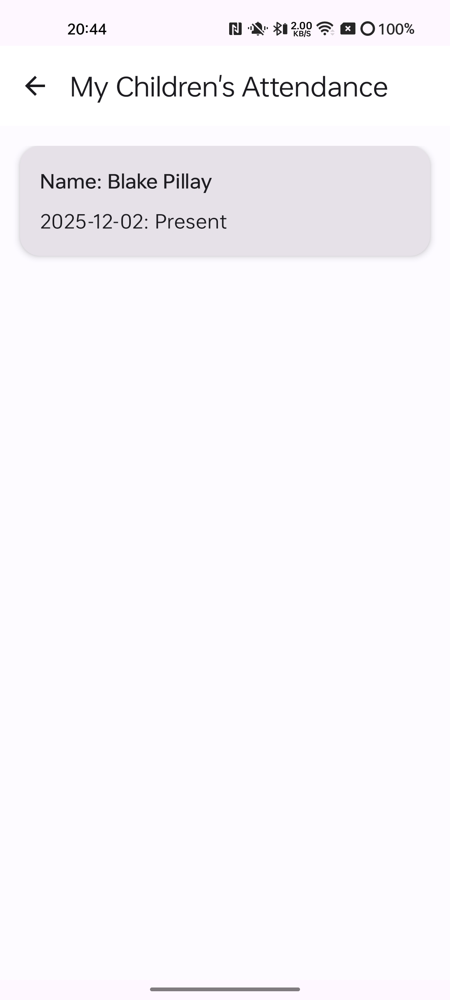  

  Parents can view attendance history with automatic highlighting for absences and late records.

- **Events**
  
  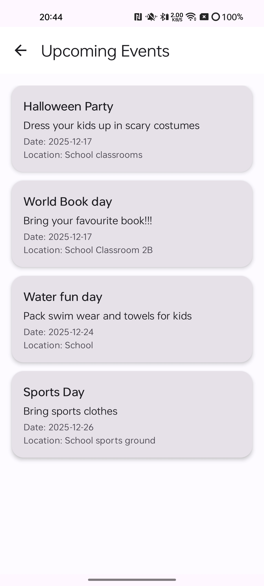 

  Displays all upcoming events with details, visible only to parents. Option to add events to device calendar.

- **Announcements & Messages**
  
  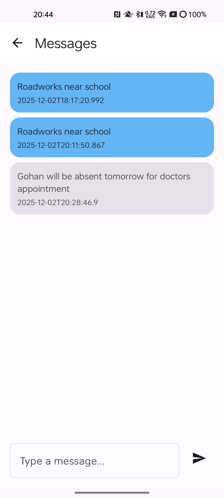
  
  Central hub for communication between parents and Admins. Includes sent and received messages, with timestamps.

- **Meal Orders**  
  Allows parents to browse daily menus and place meal orders. Updates sync in real-time with Firebase.

---
## Firebase Firestore Database Screenshots:

- Announcements Collection: 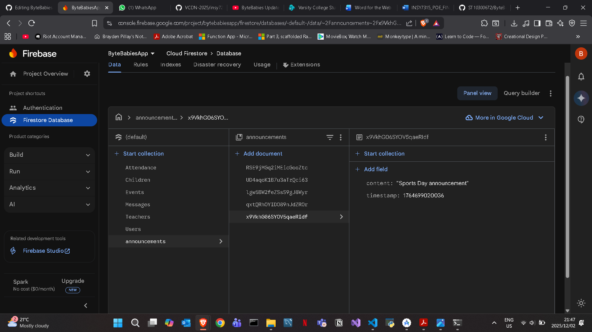 – Shows the database entries for all announcements, including title, description, date, and associated children.
  
- Attendance Collection: 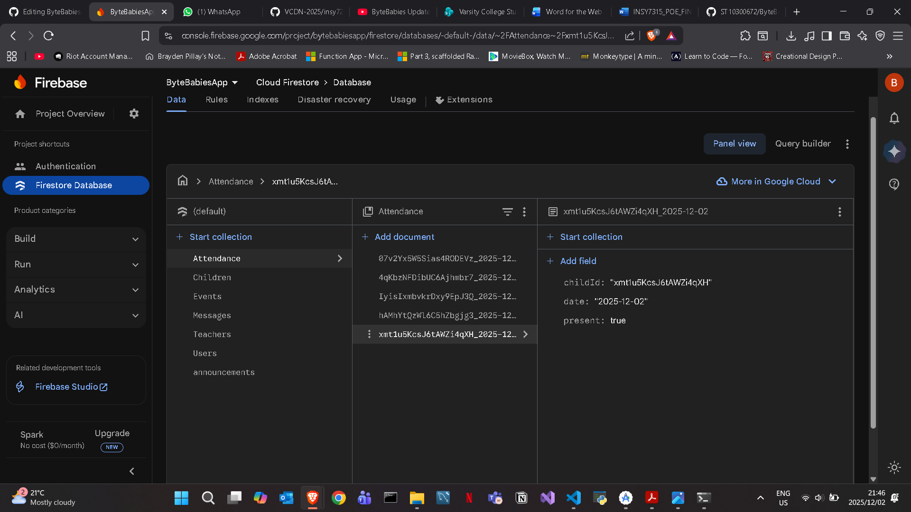 – Displays all recorded attendance entries with child, date, and presence/absence status.
  
- Children Collection: 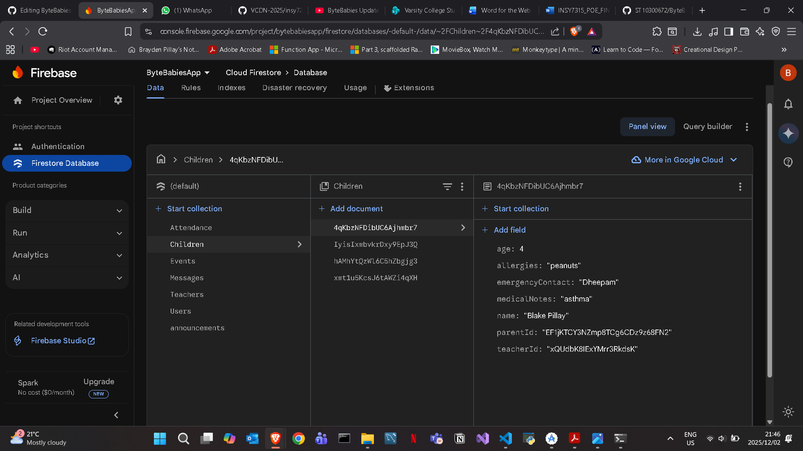 – Contains all child profiles, including assigned parent, teacher, and other metadata.
  
- Events Collection: 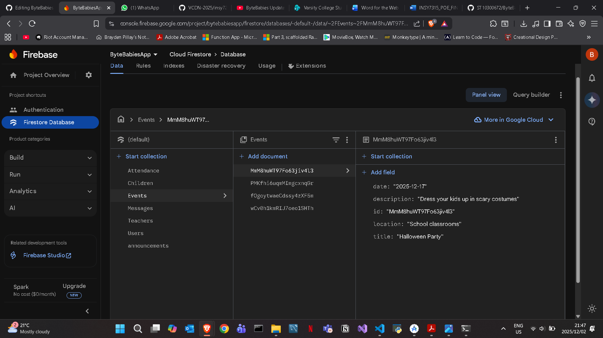 – Shows all events created in the system, including title, date, description, and assigned children.
  
- Messages Collection: 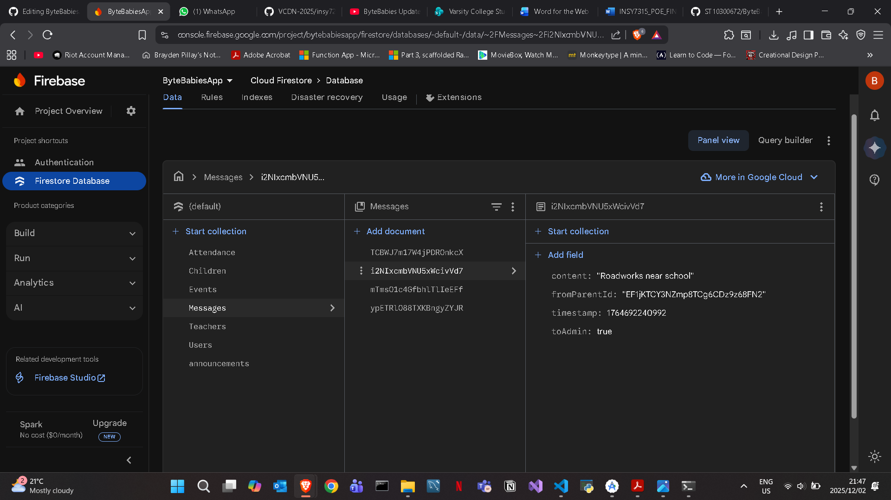 – Displays all messages sent between parents and admin/teachers.
  
- Teachers Collection: 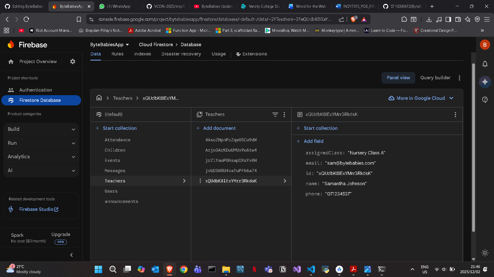 – Contains teacher profiles with assigned classes, children, and contact info.
  
- Users Collection: 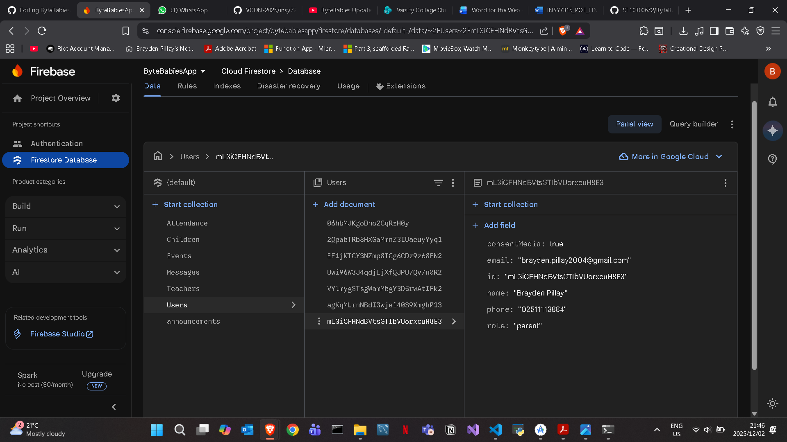 – Shows all registered users (admin, parents, teachers) with role, login info, and metadata.


---

### General Features
- **Secure Authentication** – Role-based login (Admin or Parent) with Firebase Auth.  
- **Modern UI** – Material 3 components, dynamic gradients, and intuitive card-based navigation.  
- **Profile Switching** – Log out and switch between Admin and Parent roles safely.  
- **Firebase Backend** – Real-time database updates, secure storage for media, and cloud-hosted authentication.  
- **Validation Logic** – Ensures relational integrity, prevents invalid deletions, and validates user inputs.  

---

## Tech Stack

| Component | Technology |
|------------|-------------|
| **Frontend** | Kotlin, Jetpack Compose, Material 3 |
| **Architecture** | MVVM + Repository Pattern |
| **Navigation** | Jetpack Navigation Compose |
| **Image Loading** | Coil |
| **Backend** | Firebase Firestore & Auth |
| **Payments** | PayFast Sandbox (WebView) |
| **Build Tool** | Gradle 8+ |
| **Minimum SDK** | 24 (Android 7.0) |
| **Target SDK** | 35 (Android 15) |

---

## Folder Structure

```text
app/
├── data/
│   └── Repo.kt          # Firebase-powered repository for CRUD operations and real-time data handling
├── model/               # Data models (Parent, Child, Teacher, Event, Message, Attendance, Media)
├── navigation/
│   └── Route.kt         # Navigation graph and route definitions
├── ui/
│   ├── components/      # Reusable composables, cards, top bars, buttons
│   └── screens/         # Feature screens for Admin & Parent dashboards, CRUD operations, and details
├── MainActivity.kt      # Entry point, sets up navigation
├── build.gradle         # App-level Gradle config
└── settings.gradle      # Project settings
```

---

## Setup Instructions

1. **Clone the repository:**
   ```bash
   git clone https://github.com/<your-username>/ByteBabies.git
   ```
2. **Open the project** in Android Studio (Giraffe or newer).  
3. **Allow Gradle sync** to complete.  
4. **Run the app** on an emulator or connected device (Android 7.0+).  
5. **Optional:** Replace the `screenshots/` folder with high-resolution screenshots for documentation.

---

✅ **Notes on Logic & Features:**  
- CRUD operations for Parents, Teachers, and Children are fully Firebase-powered.  
- Attendance logic automatically triggers notifications for absent children.  
- Event and message updates are real-time and visible across roles.  
- Payment simulation uses PayFast sandbox securely via WebView.  
- Media uploads respect parental consent flags and are stored in Firestore Storage.

## Updated Youtube Demo

**Video Demo:**
- [Watch the ByteBabies App Demo](https://youtu.be/f5kkHQF3HCk) – A full walkthrough of the app showing Admin and Parent dashboards, CRUD operations, and database integrations.

